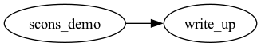

# SCons Tutorial

SCons (similar to Make) is a build tool that makes updating files easier.
When upstream code changes, ensuring all downstream code is executed takes effort.
SCons specifies the dependencies between files
    and identifies which code needs to be re-run.
The key advantage of SCons compared to Make, for our purposes,
    is that SCons is Python-based,
    so we can achieve cross-platform support with less coding.
There is a user guide for SCons,
    but the examples are in C++ and might be too elaborate for our purposes,
    so please just refer to this tutorial.

## Installation

Please follow the instructions in `python.md` to set up the Conda environment,
    which installs SCons.
To enable Stata support with SCons,
    please follow the instructions in `tasks/common/code/README.md`.
We use [pystata](https://www.stata.com/python/pystata18/) to integrate Stata and SCons.

If you want to use Julia, please install Julia
    and make sure Julia can be run from the terminal
    **AFTER** activating the conda environment for this project (try `julia --version`).

If you want to use Matlab, please install it then add it to PATH.
Running `matlab` from the terminal should launch the Matlab GUI.

## Basics

SCons allows us to construct environments (setting environment variables, etc.),
    and within an environment, there are builders that handle code execution.
We have coded builders for Python, Julia, Stata, Matlab and symbolic links.
Builders, as the name implies, execute the code.

In the `tasks` directory, there is a [`SConstruct`](../../tasks/SConstruct) file
    that governs code execution for all tasks.
In this file, an environment is usually initialized
    and locations of the `SConscript` for each task are specified.
Any `SConscript` that is not specified in `SConstruct` will not be automated.
The `SConstruct` we provide automatically searches for all `SConscript` files
    in the tasks directory (1 layer deep).

The `SConscript` specifies the relationships between outputs, inputs, and code
    for this task.
See [`SConscript`](../../tasks/scons_demo/SConscript) for an example.
A `SConscript` is needed if the task requires automation via SCons.

### Builders

Builders are specific to an environment in SCons.
Hence, we recommend using the provided `init_env()` to create
    an environment with `Python`, `Julia`, `Stata`, etc. builders included,
    as we did in [`SConstruct`](../../tasks/SConstruct).
To call a builder, we use `env.<Builder name>`
    (see [`SConscript`](../../tasks/scons_demo/SConscript) for an example)
    and pass in the parameters for source and target
    (you can pass in a list when there are multiple sources and/or targets).
The source parameter specifies what files are used to produce the target(s).
The target parameter indicates what the output file(s) are from the source(s).
When specifying file paths, SCons allows the use of `#` in `SConscript`,
    which means relative to the `SConstruct` file.
Otherwise, all paths are relative to the `SConscript`.

**NOTE:** When writing code, please also use relative paths
    and assume code is executed in the directory containing it.

#### Custom builders

For `Python`, `Julia`, `Stata`, and `Matlab` builders,
    only the **first** source will be executed,
    but passing additional sources specifies the additional dependencies for the target(s).
For example, the code might use a dataset, which should be included in the source argument.
To specify arguments when running a script (Python, Julia, or Stata),
    use the `ARGS` parameter in the builder.
All the print statements and error messages in the scripts are redirected to
    a log file with the same filename as the first source file but with a `.log` extension,
    mimicking the behavior of Stata in batch mode.
To store the log file with a different name or path,
    set the `LOG_FILE` parameter when calling the builder.
For example, the code below stores the log file to a different path:

```python
env.Python(
    target=["output/example.txt"],
    source=["code/example.py"],
    LOG_FILE="logs/different_filename.log",
    ARGS=["args_1", "args_2"]
)
```

**Note:** Since by default, the log uses the same filename as the first code file,
    when running the builder in a loop you should ALWAYS specify the log file path.

```python
# BAD: will throw an error since there are multiple ways to create `code/sample.log`
for i in range(10):
    env.Python(
        target=[f"output/sample{i}.txt"],
        source=["code/sample.py"],
        ARGS=[str(i)]
    )

# GOOD
for i in range(10):
    env.Python(
        target=[f"output/sample{i}.txt"],
        source=["code/sample.py"],
        LOG_FILE=f"code/sample{i}.log",  # specify a different log file for each iteration
        ARGS=[str(i)]
    )
```

The `Link` builder creates a symbolic link between the source and the target.
This builder is essential when using output or code from another task.
If SCons does not have permission to create a symbolic link, it will copy the file.
If you want to copy the file rather than creating a symbolic link,
    set the parameter `COPY` to `True` when using the `Link` builder.
The `Links` builder is provided for linking multiple files.

### Build the project

After writing the code and `SConscript` files,
    we can build the project by executing `scons` in the terminal
    where the `SConstruct` file is located (`tasks` directory).
To clean up (delete all output and log files), run `scons -c`.
We can ignore errors with the `-i` flag, and `-j N` allows us to run N jobs simultaneously.
If you only want to build a specific task, use `scons <task name>`.

### Task graph

To create the task graph:
1. Make sure that Graphviz is installed [(manual installation)](https://www.graphviz.org/download/)
2. Enable it in `tasks/SConstruct`

This visualization helps you understand task relationships and pipeline flow.
For example, the task graph below implies that the `write_up` task 
    depends on `scons_demo`.

Task graph will be stored in `tasks/task_graph/output/task_graph.png`.

**NOTE:** SCons supports cloning the environment via `env.Clone()`.
    Any dependencies specified in a cloned environment are excluded from the task graph.

## Miscellaneous

SCons can also be used to build PDFs from LaTeX files
    (see [../../tasks/write_up](../../tasks/write_up) for an example).
If you want to use other software with SCons, reach out to Shih-Hsuan.
R is not supported; use Python or Julia instead.
